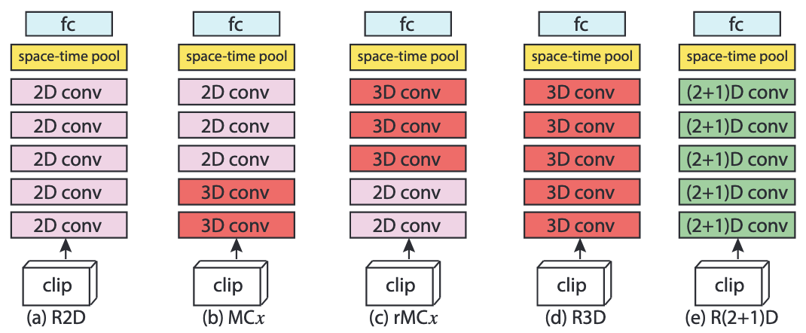

# Architekturen

```{note}
Die in diesem Abschnitt betrachteten spatio-temporal Convolutional-Varianten sind alle im Rahmen des Residualen-Lernens zu betrachten.
Des Weiteren werden nur "Vanilla-Blocks" (bspw. ohne Bottlenecks) verwendet. Ein Block besteht dabei aus 2 Convolutional-Schichten oder -Layer, sowie einer Aktivierungsfunktion nach den Beiden.
Für die Klassifizierung ist ein fully-connected Layer verantwortlich.
```

## Variablen

Unseren Input-Tensor

$x = 3 \times L \times H \times W$

wobei 

- $L$ der Anzahl der Frames des Ausschnittes entspricht,
- $H$ und $W$ für die Höhe und Breite eines Frames stehen und
- $3$ für die Farbkanälen steht.

Den Tensor $z_i$ wird über den $i$-ten Convolutional-Block des Residualen-Netzwerkes berechnet. Der Output des $i$-ten Blockes entspricht demnach

$z_i = z_{i-1} + F(z_{i-1};\theta _i)$

wobei 

- $F(;\theta _i)$ die Komposition von 2 Convolutions, mit den Gewichten $\theta _i$ und Aktivierungsfunktionen, implementiert.

## R2D: 2D Convolutions über Ausschnitt

Da bei 2D CNN's für Videos die temporale Anordnung der Frames nicht beachtet wird, werden diese wie Kanäle behandelt.
Der 4D Input-Tensor entspricht demnach einem 3D Input-Tensor.
Der Output $z_i$ des $i$-ten Blockes ist auch ein 3D Tensor. Dessen Größe ist

$N_i \times H_i \times W_i$

wobei

- $N_i$ der Anzahl der im verwendeten Convolution-Filter im $i$-ten Block entspricht und
- $H_i$ und $W_i$ die spatial Dimensionen, die durch Pooling oder Striding abnehmen können, sind.

Jeder Filter ist 3D und mit der Größe

$N_{i-1} \times d \times d$

wobei

- $d$ für die räumliche Breite und Höhe steht.

```{note}
Die Convolution der 3D Filter sind nur über die räumlichen Dimensionen (und dementsprechend 2D) des vorhergehenden Tensors $z_{i-1}$. So fasst die erste Convolution-Schicht, indem alle Filter nur einen Output-Kanal haben, alle Informationen in einen Kanal zusammen. Entsprechend sind in den weiteren Schichten diese temporalen Informationen nicht mehr nachzuvollziehen.
```

## F-R2D: (Frame-based) 2D Convolution

In diesem Ansatz werden die Frames unabh. voneinander über eine Reihe 2D Residual-Blöcken bearbeitet. Hierbei werden die selben Filter für alle Frames verwendet.
Sprich: In den Convolutional-Schichten wird nicht temporal modelliert.

## R3D: 3D Convolutions

3D Convolutions erhalten temporale Informationen und verbreiten diese durch die Schichten des Netzes. Der Tensor $z_i$ ist in diesem Fall 4D mit der Größe

$N_i \times L \times H_i \times W_i$

wobei

- $N_i$ für die Anzahl der verwendeten Filter des $i$-ten Blocks steht.

Alle Filter sind 4-dimensional und entsprechen der Größe

$N_{i-1} \times t \times d \times d$

wobei

- $t$ die temporale Breite des Filters beschreibt. Im Rahmen dieser Arbeit setzten wir diese auf 3.

Demnach sind die Filter 3D und decken zeitliche- als auch räumliche Dimensionen ab.

## MC$x$: Mixed 3D-2D Convolutions

Eine Hypothese ist, dass das Modellieren von Bewegungen (bps. mittels 3D Convolutions) in früheren Schichten besonders nützlich ist, dies aber in abstrakteren/ oder späteren Schichten nicht mehr der Fall ist.
Dementsprechend könnte eine vielversprechende Architektur mit 3D Convolutions starten, und mit 2D Convolutionen enden.

Da wir in dieser Arbeit 3D Residual Netzwerke (R3D) mit 5 Bereichen von Convolutionen betrachten, erstellen wir die Netzwerke "Mixed Convolutions 2-5 (MC 2-5)". Der Index steht dabei für den entsprechenden Bereich, ab welchem die 3D -, durch 2D Convolutionen ersetzt werden (MC4 bspw. beschreibt eine CNN-Architektur mit 3D Convolutionen, mit 2D Convolutionen in der 4. und 5. Schicht).
MC1 entspricht dabei einer "Vanilla" F-R2D Architektur, welches bereits beschrieben wurden.

Alternativ besteht die Hypothese, dass das Modellieren in tieferen Schichten von Vorteil sein könnte, wenn die Erscheinungs-Informationen in frühen Schichten via 2D Convolutionen erfasst werden. Um dem nachzukommen, experimentieren wir auch mit "Reversed Mixed Convolutions".
Mit der identischen Namenskonvention erhalten wir die Modelle: R-MC2, R-MC3, R-MC4 und R-MC5 (R-MC3 würde demnach 2D Convolutionen in Block 1 und 2 haben, während der Rest der Architektur aus 3D Convolutionen besteht).

## R(2+1)D: (2+1)D Convolutionen

Eine weitere Theorie beinhaltet, dass das Auftrennen der Merkmale mittels einer 2D und 1D Convolution, 3D Convolutionen besser abbilden kann. Demnach wird die Architektur R(2+1)D implementiert, in welcher die $N_i$ 3D Filter der Größe 

$N_{i-1} \times t \times d \times d$

durch einen (2+1)D Block bestehend aus 2D Filter (Höhe/ Breite) $M_i$ der Größe 

$N_{i-1} \times 1 \times d \times d$

und Filter (Zeit) $N_i$ der Größe

$M_1 \times t \times 1 \times 1$

ersetzt wird.

Der Hyperparameter $M_i$ bestimmt die Dimensionalität des Unterraums, in welchem sich die Convolutionen befinden. In unserem Fall wird $M_i$ so bestimmt, dass die Anzahl der Parameter in den Blöcken identisch zu denen einer 3D Architektur sind. 
Das beschriebene Raum-Zeit-Auftrennen kann in allen Schichten verwendet werden.
Operationen wie bspw. Striding werden auch, entsprechend ihrer Dimension, zerteilt. 
Dies kann im Anschluss, in der vereinfachten Version, in welcher der Input-Tensor aus nur einem Kanal besteht ($N_{i-1} = 1$), betrachtet werden:

d_architecture.png)

Links: 3D Convolution mit Filter der Größe 

$t \times d \times d$

wobei

- $t$ die zeitliche Komponente abbildet und
- $d$ die räumliche Höhe und Breite.

Rechts: Ein (2+1)D Convolution Block, bestehend aus einer 2D Convolution (Raum) und einer 1D Convolution (Zeit). Die Anzahl der 2D Filter ($M_i$) wird so bestimmt, dass die Anzahl der Parameter der eines 3D Convolution Blockes entspricht. 

Vorteile der Architektur im Vergleich zu einer "normalen" 3D Architektur:
- Trotz einer identischen Anzahl an Parametern, verdoppeln sich die Nichtlinearitäten/ Funktionen im Netz (durch die Funktionen zwischen den 2D - und 1D Convolutionen). Dies erhöht die Komplexität der darstellbaren Funktionen, wie bereits in VGG Netzen zu beobachten war.
- Das Auftrennen in räumliche- und zeitliche Komponenten vereinfacht das Optimieren, denn die Fehlerrate beim Trainieren des Netzes war für 3D Convolutional Netze trotz identischen Umständen (Anzahl Schichten, Parameter, ...) höher (mehr später).

## Überblick

