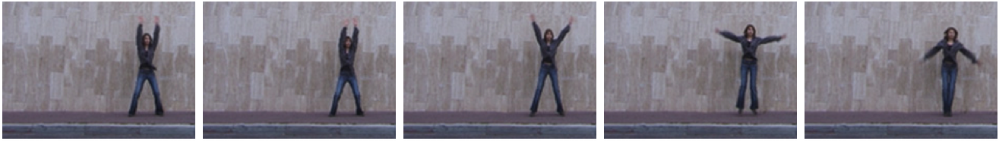
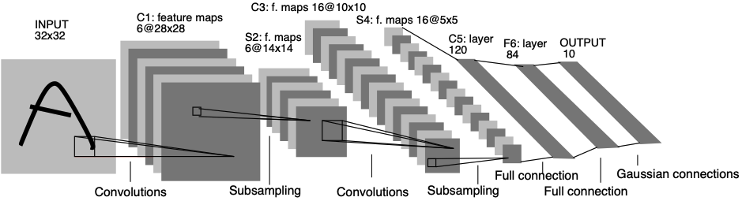
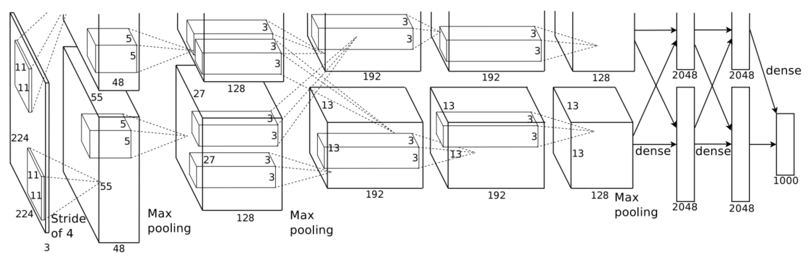
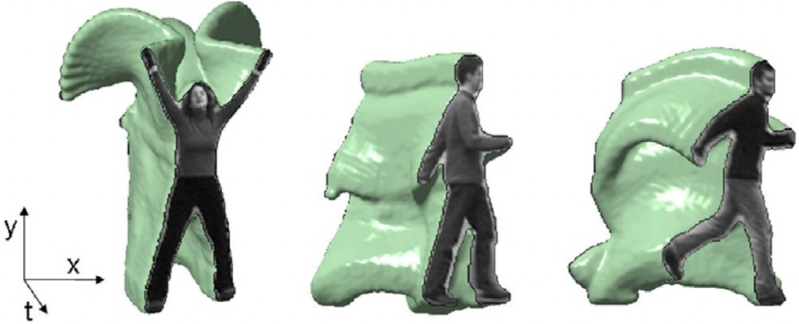
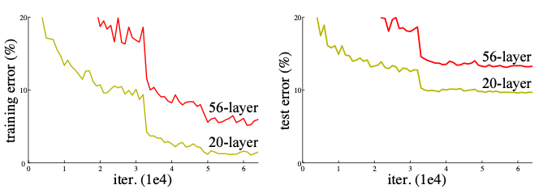
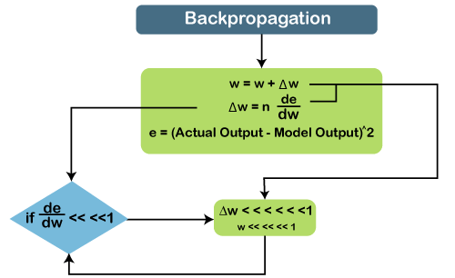
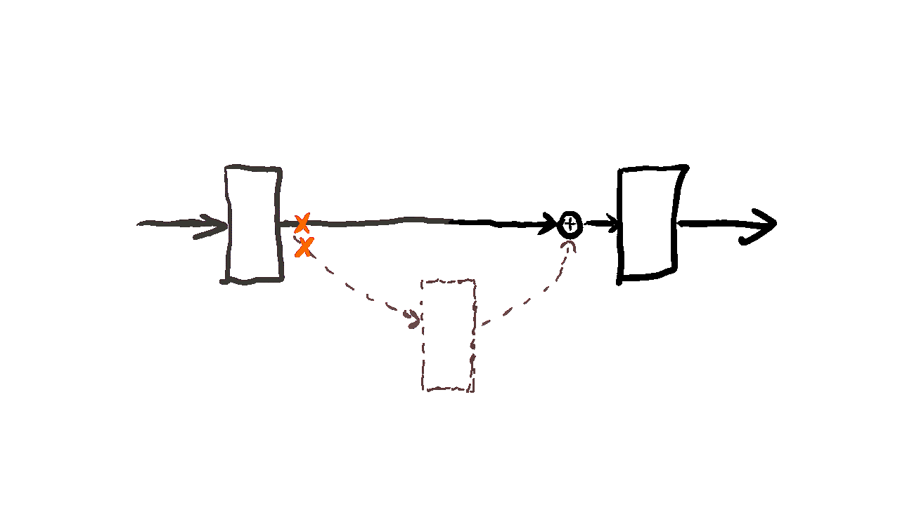
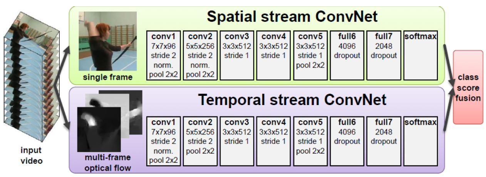
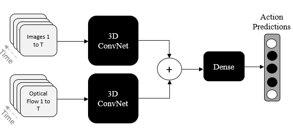

# Grundlagen

In dieser Vortrag geht es speziell um Video-Basierte Action Recognition. Doch ist es erstmals wichtig zu klären, was das Inputsignal im Deep Learning Kontext ist. 
Notwendigerweiser nehmen Images und Videos als Inputs Anwendung in dieser Domäne. Es gilt diese Begriff voneinander bedingt voneinander zu differenzieren.
Ein Image $I$ ist ein 2D-Signal bestehend neben den Anzahl von Kanälen aus spatialen (räumlichen) Komponenten:

$I = x \times y$ 

wobei 

- $x$, $y$ den spatialen Koordinaten eines Signals entsprechen.

Formell ist ein Video ein 3D-Signal $V$ bestehend aus der Anzahl der Kanälen, spatialen (räumlichen) und temporalen (zeitlichen) Kompontenten:

$V =  x \times y \times t$

wobei

- $x$, $y$ den spatialen Koordinaten eines Signals entsprechen,
- $t$ die temporale Koordinate eines Signals entspricht.

Je nachdem ob $t$ präsent ist, ist das Signal ein Video oder ein Image. Somit können wir Videos als eine zeitlich aufeinanderfolgende Reihe von Images verstehen. 

{cite}'1544882'

### Convolutional Neural Networks (CNN)

Gerade für Daten mit einer gitterartigen Topologie und Raum-Zeit Beziehung wie Bilder eignen sich Convolutional Neural Networks (CNN) sehr gut als Stand der Technik. 

Ein CNN folgt einem hierarchischen Modell, das wie ein Trichter ein Netzwerk aufbaut und schließlich eine vollständig verbundene Schicht hervorbringt, in der alle Neuronen miteinander verbunden sind und die Ausgabe verarbeitet wird. CNNs können zum Beispiel dazu verwendet werden, Objekte in einem Bild zu identifizieren oder ein Bild als Katze oder Hund zu klassifizieren. CNNs können auch für komplexere Aufgaben verwendet werden, wie z. B. die Identifizierung von interessanten Punkten in einem Bild. CNNs können auch für Zeitreihendaten wie Audiodaten oder Textdaten verwendet werden. CNNs sind ein leistungsfähiges Werkzeug im Deep Learning, mit dem in vielen verschiedenen Anwendungen hervorragende Ergebnisse erzielt wurden.

Ein CNN besteht aus: 

- Input Layer
- Convolutional Layer
- Pooling Layer
- Fully Connected Layers 
- Output Layer

#### Convolutional Layer 
bestehen aus einer Reihe von Filtern (auch Kernel genannt), die auf ein Eingangsbild angewendet werden. Die Ausgabe der Convolutional Layer ist eine Feature Map, die eine Darstellung des Eingangsbildes mit den angewendeten Filtern ist. Convolutional Layer können gestapelt werden, um komplexere Modelle zu erstellen, die kompliziertere Merkmale aus Bildern lernen können. 
#### Pooling Layer
Sind eine Art Convolutional Layer. Pooling-Layer reduzieren die räumliche Größe der Eingabe, wodurch sie leichter zu verarbeiten sind und weniger Speicherplatz benötigen. Pooling hilft auch, die Anzahl der Parameter zu reduzieren und macht das Training schneller. Es gibt zwei Hauptarten von Pooling: Max-Pooling und Average-Pooling. Beim Max-Pooling wird der Maximalwert aus jeder Feature Map genommen, während beim Average-Pooling der Durchschnittswert genommen wird. Pooling-Schichten werden in der Regel nach Convolutional Layer verwendet, um die Größe der Eingabe zu reduzieren, bevor sie in eine voll verknüpfte Schicht eingespeist wird. 
#### Fully Connected Layer 
Wie der Name schon sagt, ist jedes Neuron in einer voll verbundenen Schicht mit jedem anderen Neuron in der vorherigen Schicht voll verbunden. Fully Connected layer werden in der Regel gegen Ende eines CNN verwendet, wenn das Ziel darin besteht, die von den vorherigen Schichten gelernten Merkmale für Vorhersagen zu verwenden. Wenn wir zum Beispiel ein CNN verwenden, um Bilder von Tieren zu klassifizieren, könnte die letzte vollständig verbundene Schicht die von den vorherigen Schichten gelernten Merkmale verwenden, um ein Bild als Hund, Katze, Vogel usw. zu klassifizieren. 
#### LeNet-5

Das erste CNN wurde von Lecun et. al (1998) unter der Bezeichnung "LetNet-5" vorgestellt.

{cite}'lecun-gradientbased-learning-applied-1998'

Sie wurde 1998 von Yann LeCun, Corinna Cortes und Christopher Burges für Probleme bei der Erkennung handgeschriebener Ziffern entwickelt. LeNet war eines der ersten erfolgreichen CNNs und wird oft als "Hello World" des Deep Learning betrachtet. Es ist eine der frühesten und am weitesten verbreiteten CNN-Architekturen. Die LeNet-Architektur besteht aus mehreren Convolution- und Pooling Layer, gefolgt von einem Fully Connected Layer. Das Modell hat fünf Convolution Layer, gefolgt von zwei vollständig verbundenen Schichten. LeNet war der Beginn der CNNs im Bereich des Deep Learning für Computer-Vision-Probleme. Allerdings konnte LeNet aufgrund des Problems des vanishing-gradient-problem nicht gut trainiert werden. Um dieses Problem zu lösen, wird zwischen den Convolution Layer eine verkürzte Verbindungsschicht, das so genannte Max-Pooling, verwendet, um die räumliche Größe der Bilder zu reduzieren, wodurch Overfitting verhindert wird und das CNN effektiver trainieren werden kann.
________

##### AlexNet

Das AlexNet ist ein großer Meilenstein in der Erkennung von Standbilderkennung. 

{cite}'NIPS2012_c399862d'

Mit der Einführung des AlexNet, einer CNN-Architektur hat der Bereich der Standbilderkennung große Fortschritte gemacht hat.
Es ist die Deep-Learning-Architektur, die CNNs populär gemacht hat, aufgrund seines Erfolgs im ILSVRC 2012. Sie wurde von Alex Krizhevsky, Ilya Sutskever und Geoff Hinton entwickelt. Das AlexNet hatte eine sehr ähnliche Architektur wie LeNet-5, war jedoch tiefer und größer und verfügte über übereinander gestapelte Convolution Layer. Die AlexNet-Architektur wurde für die Verwendung mit großen Bilddatensätzen entwickelt und erzielte zum Zeitpunkt ihrer Veröffentlichung die besten Ergebnisse. AlexNet besteht aus 5 Faltungsschichten mit einer Kombination aus Max-Pooling-Schichten, 3 vollständig verbundenen Schichten und 2 Dropout-Schichten. Die in allen Schichten verwendete Aktivierungsfunktion ist ReLu. Die in der Ausgabeschicht verwendete Aktivierungsfunktion ist Softmax. Die Gesamtzahl der Parameter in dieser Architektur beträgt etwa 60 Millionen.

{cite}'1544882'

Dies sind Architekturen von Neuronale Netzwerken, die in der Standbilderkennung, oder auch im 2D Bereich erfolgreich angewandt werden können. Sobald es in den 3D Bereich geht, in denen es räumlich-zeitliche Abhängigkeiten vorkommen, gibt es relativ zur Standbilderkennung zurzeit wenig bemerkenswert signifikanten Funde im Bereich der videobasierten Erkennung. Das liegt daran, dass 2D-CNNs nicht in der Lage sind, temporale Informationen und Bewegungsmuster zu modellieren, die man als kritische Aspekte für die Videoanalyse ansehen würde {cite}'8578773'. Um den Inhalt eines Videos effektiv beschreiben zu können, müssen die Objekte und Ereignisse in den Bildsequenzen, aus denen das Video besteht, erkannt werden. Die robuste und genaue Erkennung von Ereignissen, die in Bildsequenzen auftreten, ist jedoch nach wie vor ein Problem. Somit ist Videoverständnis eines der zentralen Probleme im Bereich von Computer Vision der letzten Jahrzehnte. In Kombination mit den aufgezeigten Beispielen stellt sich vereinfacht die Frage:

Wie kann man CNN für die Verwendung zur Analyse von Bildsequenzen erweitern und vor allem, wie ist der temporal Aspekt zu modellieren?
### Residual Neural Networks 

Da Bildsequenzen eine sehr große Anzahl von Informationen erhalten gilt es diese so gut wie möglich zu erfassen. Je größer die Inputsignale, desto komplexer und tiefer muss ein neuronales Netz sein, da mehr Features extrahiert werden müssen. Es ist Naiv anzunehmen, dass eine höhere Anzahl von Layern in besseren Ergebnissen resultiert. Long et. al fanden heraus, dass die Erhöhung der Layeranzahl eines neuronalen Netzes die Performance im Training verschlechtert.

Dies hängt unmittelbar mit dem vanishing/exploding Gradient Problem zusammen, welchen tiefen neuronalen Netzen ausgesetzt sind. Sehr tiefe Netze haben oft ein Gradientensignal, das schnell gegen Null geht, was den Gradientenabstieg untragbar langsam macht.

Dies führt dazu, dass die Neuronen in den früheren Schichten sehr langsam lernen, verglichen mit den Neuronen in den späteren Schichten. Die Gradienten werden in den früheren Schichten sehr klein sein, d.h. es gibt keinen großen Unterschied zwischen dem neuen und dem alten Gewicht. Dies führt zum Problem des verschwindenden Gradienten.
Die Verschlechterung des Gradientenwertes ist proportional zur Tiefe des Netzes. Je tiefer das Netz ist, desto geringer ist die Wahrscheinlichkeit, dass der Gradient am Ende der Backpropagation einen geringeren Wert annimmt.
Genauer gesagt, multiplizieren sich während des Gradientenabstiegs beim Backpropagation-Algorithmus von der letzten Schicht zurück zur ersten Schicht bei jedem Schritt mit der Gewichtsmatrix. Wenn die Gradienten aufgrund der großen Anzahl von Multiplikationen klein sind, kann der Gradient exponentiell schnell auf Null sinken oder exponentiell schnell wachsen und "explodieren" und sehr große Werte annehmen. 
Wenn tiefere Netze zu konvergieren beginnen, wird ein Degradationsproblem deutlich: Mit zunehmender Netztiefe wird die Genauigkeit gesättigt und verschlechtert sich dann rasch.

Ein Interessanter Ansatz für die Lösung dieses Problems ist die Wahl von Residuale Neuronale Netzwerke.

Auch als ResNet bezeichnet, bedienen sich an dem Konzept "Überspringen von Verbindungen" zwischen Convolution-Layer. Die "Skips" werden als Residual Blöcke bezeichnet und sind die Basis für die ResNet Architektur. In einem gängigen CNN sind die Convolution Layer aufeinander gestapelt bzw. laufen sequentiell chronologisch ab. Durch das Überspringen von Convolution Layer, addiere

Mit Residualen neuronalen Netzwerken im Kontext von Action Recognition haben sich Du Tran et. al in unserem Basispaper {cite}'8578773' verschiedene Architekturen für Action Recognition Tasks empirisch Untersucht.
### Two-Stream-Convolutional Neural Network 

{cite}'1544882'

Simonyan und Zisserman {cite}'https://doi.org/10.48550/arxiv.1406.2199' schlagen 2014 eine Two-Stream-Architektur vor, die spatiale und temporale Merkmale getrennt verarbeitet. Ein Einzelbild des Videos wird an ein 2D-Faltungsnetz weitergeleitet, während der vorverarbeitete optical Flows mehrerer Bilder an ein separates 3D-CNN weitergeleitet wird. Jeder Stream bildet eine Vorhersage, und die Klassenbewertung wird durch ihre Fusion bestimmt. Der Nachteil dieser Architektur ist, dass sie nicht durchgängig trainierbar ist, da der optical Flow separat berechnet werden muss und beide Ströme separat trainiert werden müssen. Der räumliche Stream kann aus großen Bilddatensätzen lernen, während der zeitliche Stream auf einem Videodatensatz trainiert werden muss. Auf diese Weise ist das Transfer-Lernen für diese Architektur nicht vollständig anwendbar. Außerdem erschwert die für die Berechnung des Optical Flows die erforderliche Vorverarbeitung die Echtzeitfähigkeit dieses Algorithmus. 

Der State of the Art Ansatz mit der besten Performance ist die Kombination aus 3D-Convolutions, Residualem lernen sowie der Two Stream Verarbeitung von spatialen und temporalen Merkmalen. Sie ist bekannt als I3D Architektur {cite}'https://doi.org/10.48550/arxiv.1406.2199',{cite}'https://doi.org/10.48550/arxiv.1611.02155', {cite}'https://doi.org/10.48550/arxiv.1705.07750'

# Inferenz

alle Grundlagen 
