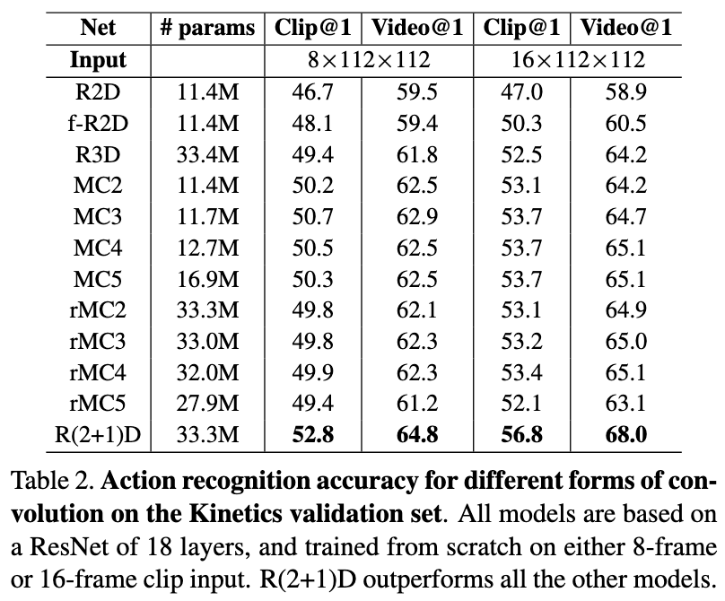
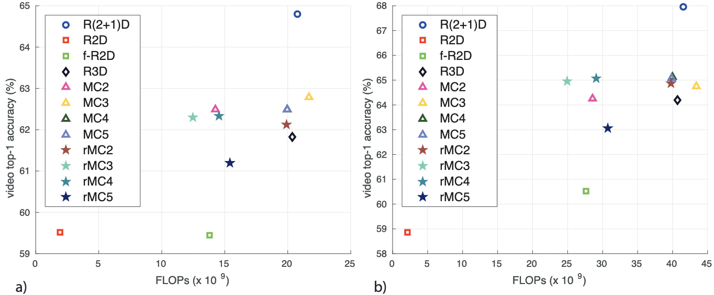
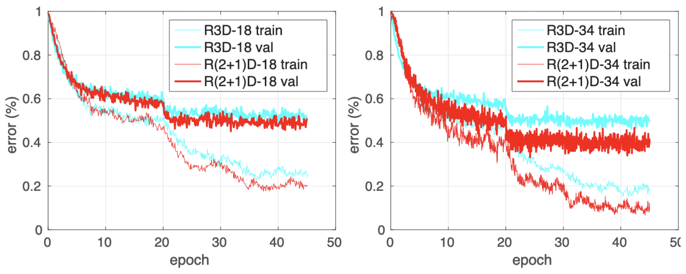
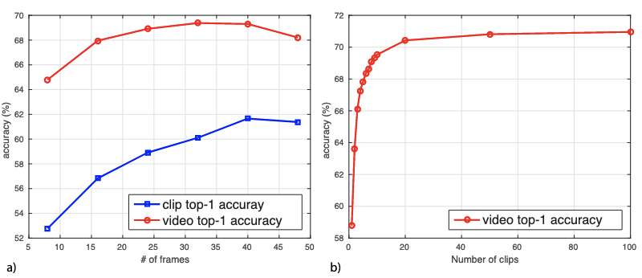
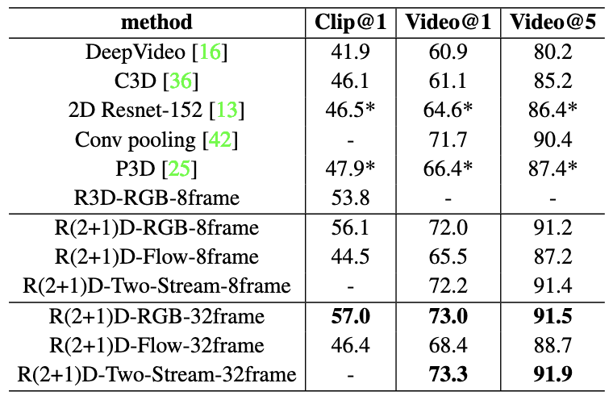
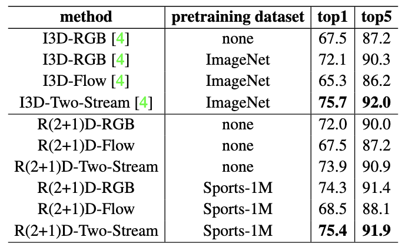
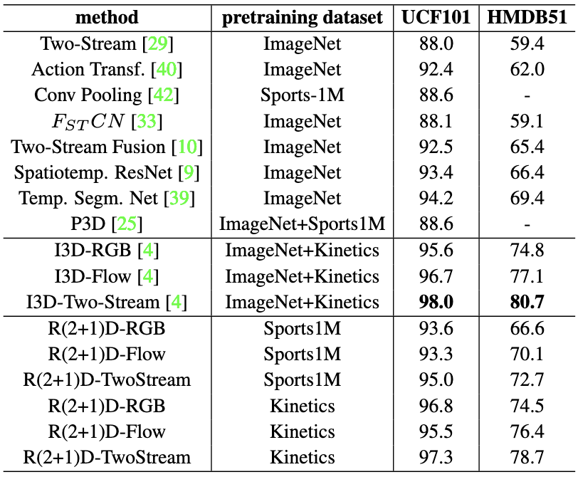

# Experimente

```{note}
Die Datensets, auf welchen die verschiedenen Architekturen trainiert werden, entsprechen [Kinetics](https://www.deepmind.com/open-source/kinetics) und [Sports-1M](https://cs.stanford.edu/people/karpathy/deepvideo/). Diese umfassen eine ausreichende Größe, sodass auch tiefe Modelle von Grund auf trainiert werden können.
Da ein *gutes* Video-Modell auch effektives Transfer-Lernen (auf andere Datensets) unterstützen sollte, ziehen wir die Datensets [UCF101](https://www.crcv.ucf.edu/research/data-sets/ucf101/) und [HMDB51](https://serre-lab.clps.brown.edu/resource/hmdb-a-large-human-motion-database/) dazu, auf die Modelle entsprechend fine-tuned werden sollen.
```

## Setup

### Netzwerk Architektur

Die Experimente werden auf Deep-Residual-Netze, durch deren Einfachheit und Leistungspotential, beschränkt.
Es existieren 2 R3D Architekturen (3D ResNet) für das Experiment. 
Die erste Architektur umfasst 18, und die Zweite 34 Schichten.

Der Input der Netze bestehen aus RGB-Frames mit einer Größe von 112 x 112.
Downsampling wird in der ersten Schicht, in Form von Striding von $1 \times 2 \times 2$ (spatial) und in den Schichten 3, 4 und 5 $2 \times 2 \times 2$ (spatio-temporal) verwendet.

Von den beschriebenen R3D Modellen leiten wir die Architekturen für R2D, MC$x$, RMC$x$ und R(2+1)D ab, indem die 3D Convolutionen entsprechend mit 2D, Mixed-Convolutions, Reversed-Mixed-Convolutions und R(2+1)D Convolutions ersetzt werden.

In den Architekturen, in welchen 3D durch 2D Convolutions ersetzten werden (z.B in RMC$x$), wird das 3D Downsampling (spatio-temporal) entsprechend nur noch 2D (spatial). 
Dieser Unterschied führt zu Aktivierung-Tensoren unterschiedlicher Größe (temporal) in der finalen Schicht, bis zu welcher unabh. davon in allen Netzwerken ein spatio-temporales Average-Pooling implementiert wird.
Die Klassifizierung erfolgt dann mittels einer Fully-Connected-Schicht, deren Dimension der Anzahl der Klassen entspricht (z.B 400 für Kinetik).

### Training und Evaluation

Für einen ersten Versuch verwenden wir Kinetics. 
Hierfür teilen wir das Set entsprechend für das Training und die Validierung.
Um die Netze fair bewerten zu können, erhalten diese alle 18 Schichten und werden von Grund auf, mit dem selben Input, trainiert.

Das der Input, sprich die Frames der Videos, die erwünschte Größe erreichen, werden diese erst entsprechend auf eine Größe von $128 \times 171$ verkleinert. Hiernach schneiden wir die Frames, per Zufall, auf die Input-Größe von $112 \times 112$ zu.

Wir nehmen, um die Modelle zu trainieren, $L$ konsekutive Bilder eines Videos. Im Rahmen dieser Arbeit experimentieren wir dafür mit 8 und 16 Frame Clips ($L$ = 8 oder $L$ = 16).

Batch-Normalization wird in allen Schichten verwendet.
Wir verwenden eine Batch-Größe von 32 Clips pro GPU.
Wir teilen die Lernrate, die initial 0.01 ist, alle 10 Epochen durch 10.
Der Trainings-Prozess umfasst 45 Epochen.

Wir erhalten die Clip-Top-1-Accuracy und Video-Top-1-Accuracy.
Für die Video-Top-1-Accuracy werden die mittleren Ausschnitte von 10 Clips, die dem Video proportional entnommen werden, verwendet. Der Durchschnitt dieser 10 Clip-Vorhersagen entspricht dann der Video-Prediction.

```{note}
Top-1-Accuracy ist die konventionelle Accuracy/ Genauigkeit, sprich die Modellantwort (mit der höchsten Wahrscheinlichkeit) muss die erwartete Antwort sein.
```

### Vergleich der spatio-temporal Convolutions

*Die in diesem Abschnitt verwendeten Zahlen und Erkenntnisse sind der anschließenden Tabelle entnommen.*



Es besteht ein deutlicher Unterschied in der Performance der 2D (R2D und F-R2D) und 3D oder vermischten Residual Netzen (MC$x$ und R-MC$x$). Die 2D Architekturen schneiden im Schnitt bis zu 4% bei 8-Frame Clips und bis zu 6.5%, wenn die Modelle mit 16 Frame-Clips als Input trainiert wurden, schlechter ab. 
Hieraus schließen wir, dass das Modellieren von Bewegungen, von Bedeutung ist (wie in MC$x$ beschrieben).

Der Unterschied besteht darin, dass im Vergleich zu den 3D oder MC$x$ Modellen, welche die temporalen Informationen beibehalten, R2D diese Informationen innerhalb des ersten Blockes komprimiert (und entsprechend eliminiert), während F-R2D Bildmerkmale direkt aus Einzelbildern berechnet.

```{note}
Alle Modelle/ Architekturen (innerhalb derselben Einstellung) bekommen den identischen Input und verarbeiten entsprechend alle Bilder eines Clips (8 oder 16).
```

Inmitten der 3D Architekturen, erzielte R(2+1)D die beste Accuracy. So schnitt diese bei 8-Frame Clips um 2 - 3.5% besser, und bei 16-Frame Clips um bis zu 4.75% besser als R3D, MC$x$ oder R-MC$x$ ab.
Demnach ist das Auftrennen der Convolutions in Raum- und Zeit-Komponenten besser als das direkte Modellieren beider Komponenten oder das Vermischen der Architekturen (3D und 2D).
Zudem übertrifft R(2+1)D auch die 2D Architekturen (R2D und F-R2D) um 5-6% in der 8-Frame-, und um 6-10% in der 16-Frame-Einstellung.

Die nächste Abbildung stellt für die verschiedenen Formen von Convolutionen die Video-Top-1-Accuracy im Vergleich zu deren Berechnungskomplexität (FLOPs) dar:



Die linke Seite des Schaubildes (a) beinhaltet die Modelle, die mt 8-Frame-Clips trainiert wurden. Rechts (b) sind die Modelle für die entsprechenden 16-Frame-Clips ersichtlich.
R2D ist demnach das effizienteste Netzwerk, besitzt aber auch die schlechtesten Accuracy. So ist es, indem es alle temporalen Informationen in der ersten Schicht komprimiert, 7x schneller als die andere 2D Architektur F-R2D. 
Hinsichtlich der Accuracy schneiden die beiden Architekturen fast identisch ab (8-Frames: <1%, 16-Frames 1.5%).
Da wie beschrieben, R2D alle temporalen Informationen eliminiert, schneidet es mit einer zunehmender Anzahl an Frames schwächer ab.

Interessanterweise ist R-MC3 effizienter als F-R2D (alle Bilder werden unabh. voneinander verarbeitet), da die Architektur Downsampling (Temporales-Striding) implementiert.
Dementsprechend ist R-MC2 *teurer*, da es Downsampling erst ab der 3. Schicht verwendet (R-MC3 ab der 2. Schicht).

Während R(2+1) fast die identische Anzahl an Parametern und Berechnungskomplexität wie R3D hat, erzielt die Architektur eine bessere Accuracy (3-5%).

*Warum sind (2+1)D Convolutions besser als 3D Convolutionen?*



Wie dem Schaubild entnommen werden kann, erzielt R(2+1)D eine bessere Fehlerrate für Test- und Trainingsdaten. Da der Unterschied mit einer zunehmender Anzahl an Schichten (Links: 18, Rechts: 34) wächst, schließen wir, dass das Optimieren mit zunehmender Netztiefe weiter zunimmt.

## Überdenken der Praktiken für die Predictions auf Videoebene

Motiviert durch ein weiteres [Paper](https://arxiv-export1.library.cornell.edu/pdf/1604.04494), welches mittels Long-Term-Convolutions (und mit entsprechenden Input-Clips bis zu 100 Frames) die Modelle nochmals verbessern konnte, experimentieren wir auf unserer R(2+1)D Architektur mit Input-Clips von 16, 24, 32, 40 und 46 Frames.
Die Netzwerke bestehen dabei aus 18 Schichten und bei dem verwendeten Datenset handelt es sich wieder um Kinetics.
Da wir für die Netzwerke unterschiedlich viele Frames als Input verwenden, unterscheiden sich entsprechend auch deren Outputs (temporal) in der untersten Schicht.
Um die Outputs und Parameter aller Netze identisch zu halten, implementieren wir auch hier, wie zuvor, in allen Netzen ein spatio-temporales Average-Pooling.
Die Klassifizierung funktioniert unverändert, mittels einer Fully-Connected-Schicht.

Die nächste Abbildung stellt die Top-1-Accuracy auf Clip- und Videoebene im Hinblick auf die Anzahl der Frames dar.

```{note}
Die Video-Prediction entspricht dem Durchschnitt von 10 Clips, die im Video symmetrisch verteilt sind.
```



Während die Clip-Accuracy parallel zu der Anzahl der Frames zunimmt, erreicht die Video-Accuracy bei 32 Frames ihren Höhepunkt.

Um dieses Verhalten im Detail zu betrachten, führen wir 2 weitere Experimente durch.
Für das erste Experiment nehmen wir ein Netz, welches für 8-Frame-Clips trainiert wurde, und testen dies mit 32-Frame-Input-Clips.
Diese Tests schnitten in der Clip-Accuracy (1.5%) sowie der Video-Accuracy (6%) schlechter als der "normalen" 8-Frame-Inputs ab.

Im 2. Experiment tauschen wir das Setup, indem wir für den Input des 32-Frame-Modells 8 Frames verwenden.
Dieses Mal erzielt das Netz einen Unterschied von nur 0.25%, zu dem Netz, welches nicht auf 8-Frames fine-tuned wurde (59.8% vs. 60.1%). 
Dies entspricht einer Verbesserung von über 7% verglichen mit dem 8-Frame Modell.
Da das Trainieren der 8-Frame-Architektur 7.5x schneller ist, als das der 32-Frame-Architektur, kann durch das Fine-Tunen des 32-Frame-Modells mit 8-Frame-Clips die Dauer des Lernens deutlich verkürzt werden.

Die Erkenntnisse der beiden Experimente deuten darauf hin, dass das Trainieren mit mehr Frames innerhalb eines Clips zu anderen (besseren) Modellen führt. So können Netze bspw. durch eine höhere Anzahl an Frames temporale Muster besser erkennen und -lernen.
Dieses Verhalten kann aber nicht "umsonst" erreicht werden, indem die Frames erst in der Testphase erhöht werden.
Dies stimmt mit den Erkenntnissen des oben beschriebenen Papers überein.

Des Weiteren kann dem Schaubildes die Video-Top-1-Accuracy in Abh. von der Anzahl der Clips, die für die Video-Prediction verwendet wurden, entnommen werden.
Dabei stellt sich heraus, dass ab einer Input-Größe von 20 Frames kaum Unterschiede zu erkennen sind, während die Prediction 5x (20 vs. 100 Frames) schneller ist.
*Die Tests basieren auf einer R(2+1)D Architektur mit 18 Schichten, die mit 32-Frame-Input-Clips trainiert wurde.*

## Handlungserkennung einer R(2+1)D Architektur mit 34 Schichten

In diesem Abschnitt validieren wir eine 34-Schichten-Version unserer R(2+1)D Architektur auf mehreren bekannten Datensätzen.
Der Aufbau der Schichten ist dabei unverändert, und kann entsprechend dem Abschnitt *Setup* entnommen werden.

Wir trainieren die Architektur für RGB- und Optical-Flow-Inputs, sowie einer Kombination, indem wir die Predictions zusammenführen (Two-Stream-Framework).

```{note}
Optical-Flow ist ein Vektorfeld zwischen zwei Bildern. Dieses beinhaltet Informationen, wie die Pixel eines Elements (z.B Auto) des ersten Bildes verschoben werden können, um dieses im Zweiten nachzubilden. So können bspw. Geschwindigkeiten ermittelt werden.
Es ist eine Art des Korrespondenz-Lernens, denn wenn die Pixel eines Elements bekannt sind, kann das Feld berechnet werden.
Im Rahmen dieser Arbeit berechnen wir dies mittels der Methode von Farneback.
```

### Sports-1M

[Sports-1M](https://cs.stanford.edu/people/karpathy/deepvideo/) umfasst über eine Millionen Sport-Videos und 487 Sportarten.
Für diesen Datensatz trainierten wir unser R(2+1)-34, und ein R3D-34 Netz, mit 8- und 32-Frame-Input-Clips.
Da die Videos im Durchschnitt über 5 Minuten sind, nehmen wir 100 (nicht 10 wie bei Kinetics), Clips pro Video um die Top-1-Video-Accuracy zu berechnen.



Unser R(2+1)D Modell für RGBs erzielt im Vergleich mit den Weiteren die höchste Accuracy.
In der Clip-Accuracy übertrifft es C3D um 11%, P3D um 9% und 2D ResNet um 10.5%.
*Dabei ist zu beachten, dass 2D ResNet und P3D 152 aus Schichten bestehen, während R(2+1)D nur 34 Schichten hat.*
Auch das "normale" R3D ist um 2.5% schlechter (mit 8-Input-Frames).
Für die Top-1-Video-Accuracy erreicht R(2+1)D 73.3%, was dem bisher besten Wert für das Datenset entspricht.


### Kinetics

Der Datensatz [Kinetics](https://www.deepmind.com/open-source/kinetics), der bisher verwendet wurde, umfasst mehr als 300.000 Videos von über 400 menschlichen Handlungen.

Wir bewerten unsere R(2+1)D-34 Architektur auf Kinetics, indem wir das bereits auf Sports-1M trainierte Modell auf den neuen Datensatz anpassen (fine-tunen), und indem wir von Grund auf trainieren (hierbei behalten wir das bestehende Setup bei).

Für Ersteres wählen wir eine Lernrate von 0.0001, die wir alle 4 Epochen um den Faktor 4 reduzieren. Das Fine-Tuning dauert 15 Epochen.



R(2+1)D übertrifft I3D um 4.5%, wenn beide Modelle von Grund auf mit RGB-Input trainiert werden.
Unser auf Sports-1M vor-trainiertes R(2+1)D übertrifft zudem auch das auf [ImageNet](https://www.image-net.org/) vor-trainierte I3D.
In Kombination der beiden Inputs schneiden die Architekturen fast identisch ab (0.25%).
Dementsprechend ist unsere R(2+1)D-Architektur in der Handlungserkennung durchaus als Konkurrent zu werten.


### UCF101 und HMDB51

[UCF101](https://www.crcv.ucf.edu/research/data-sets/ucf101/) und [HMDB51](https://deepai.org/dataset/hmdb-51) sind etablierte Benchmarks für die Erkennung von Handlungen. UCF101 hat etwa 13.000 Videos aus 101 Klassen, HMDB51 6.000 Videos und 51 Klassen.

In unserem abschließenden Experiment wollen wir die zuvor trainierten R(2+1)D Modelle (Sports-1M und Kinetics) auf UCF101 und HMDB51 abstimmen (fine-tunen).
Für die Architekturen, die auf einem Kinetics vor-trainiertes Modell basieren, verwenden wir die von Grund auf trainierten Kinetics -, und nicht die darauf fein-trainierten Modelle.
So können wir auch Erkenntnissen zu verschiedenen Datensätzen ziehen.



R(2+1)D übertrifft alle Methoden dieses Vergleichs, mit der Ausnahme von I3D, die zum Trainieren, neben Kinetics, noch ein weiteres Datenset verwendete ([ImageNet](https://www.image-net.org/)).
Mit RGB-Inputs erzielt R(2+1)D trotz dessen eine höhere Accuracy.

Der Grund hierfür kann potentiell die im Netz implementierte Farneback Methode sein, die zwar effizient, aber nicht so exakt wie die im I3D Modell verwendete Methode ([TV-L1](https://de.mathworks.com/matlabcentral/fileexchange/57604-tv-l1-image-denoising-algorithm)) ist.