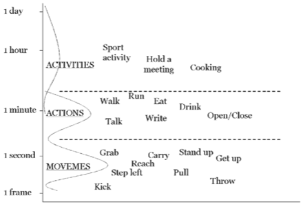
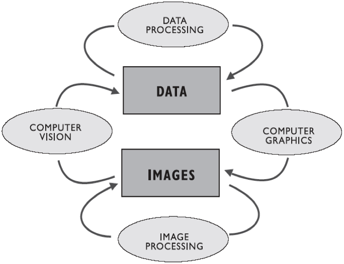
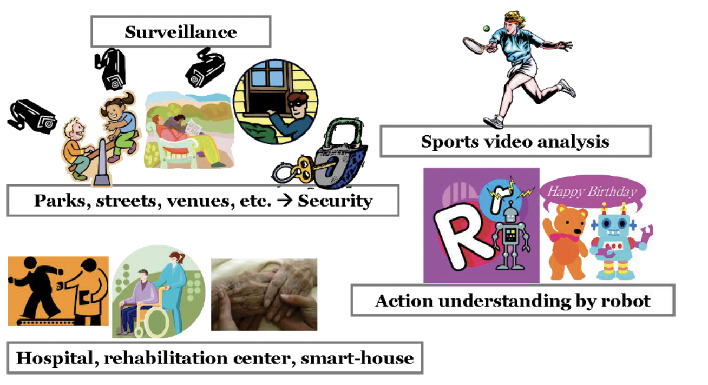

# Einführung

## Der Begriff "Action"

Der Begriff der Aktion (ff., eng. Action) kann definiert werden nach Lan et. al [1](https://proceedings.neurips.cc/paper/2012/file/c399862d3b9d6b76c8436e924a68c45b-Paper.pdf) als eine "einfache, atomare Bewegung, die von einer einzelnen Person ausgeführt wird." Hingegen sind Aktivitäten auf ein komplexeres Szenario bezogen, an dem u.a. eine Gruppe von Menschen beteiligt ist. Dies ist keine Standardterminologie und oft werden Begriffe wie Action, Activities von vielen Forschern austauschbar angewandt [2](https://www.sciencedirect.com/science/article/pii/S1077314206001263)
Ebenso gibt es keine gut-akzeptierte Nomenklatur oder Kategorisierung für Actions oder Activities.
Konsequent führt dies zur Frage, was ist denn eine bzw. welche Aktionen fallen den unter dieser Definition.

Basis dieser Kategorisierung ist Vecchio et al. [3](https://www.researchgate.net/publication/222651782_Decomposition_of_human_motion_into_dynamics-based_primitives_with_application_to_drawing_tasks). Es sollen (menschliche) Bewegungsabläufe - in diesem Kontext Aktivitäten in ihre Bauteile zerlegt werden. Dies ist definierte als *movemes*. Dabei handelt es sich um ein abstraktes Alphabet für recht primitive Bewegungen. So können aus einer Reihe von movemes eine Action konstruiert. In seiner Dissertation erweitert Fanti [4](https://thesis.library.caltech.edu/5178/) interpretiert er verschiedene (menschliche) Bewegung in einer 3-stufigen Hierarchie und stellt diese wie in Abbildung 1 auf.
## Action Recognition

Die Action Recognition (dt. Handlungserkennung) ist ein Feld der Computer Vision.
Unter Action Recognition versteht man den Versuch, festzustellen, ob die Eingabedaten ein bestimmtes Objekt, ein bestimmtes Merkmal oder eine bestimmte Aktivität enthalten oder ihnen ähneln. Man möchte eine Action Recognition-Komponente aus einem Video oder einer Bildszene zu entschlüsseln. Auf Menschen bezogen, ist Action Recognition die Aufgabe zu erkennen, wann eine Person in einem Bild oder Video eine bestimmte Handlung ausführt. 
Dazu gehört die Tatsache, dass Handlungen dynamisch sind und in der Regel nicht einfach durch die Betrachtung einzelner Zeitpunkte erkannt werden können.
## Anwendungsbereiche von Action Recognition

Das Verstehen von Bewegungen oder Aktivitäten aus Bildern und Videosequenzen ist eine sehr wichtige, aber schwierige Aufgabe. Das Gebiet der Handlungs- und Aktivitätsdarstellung und -erkennung ist recht gut erforscht [5](https://ieeexplore.ieee.org/document/5771378) aber noch nicht sehr ausgereift für viele Anwendungen im realen Leben. Die Erkennung der Identität von Personen sowie der Aktionen, Aktivitäten und Verhaltensweisen, die von einer oder mehreren Personen in Videosequenzen ausgeführt werden, ist für verschiedene Anwendungen sehr wichtig. Diverse Anwendungen sind bereits auf dieses Ziel ausgerichtet, um Videos richtig zu verstehen, z.B. in

- Intelligente Videoüberwachung,
- Mixed Reality
- Mensch-Computer-Interaktion
- Gesichtsanalyse
- Objektverfolgung
- Sport-Analytics
- usw. 
