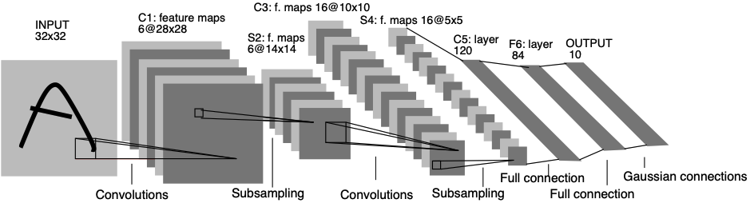
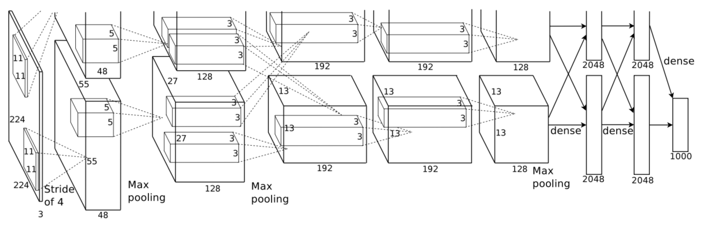

# Introduction

Hier Einleitungstext und Grundlagen (eventuell neues Kapitel ??) ...

[Sports-1M Datensatz](https://paperswithcode.com/dataset/sports-1m)

Der Begriff der Aktion (ff., eng. Action) folgt keiner universelle Terminologie aber kann angenähert werden nach Lan et. al als eine "einfache, atomare Bewegung, die von einer einzelnen Person ausgeführt wird." Konsequent führt dies zur nächsten Frage, nämlich was ist denn eine bzw. welche Aktionen fallen den unter dieser Definition

{cite}'ahad2011computer'

Die Aufgaben von 

## Kategorien von Action Recognition
## Anwendung von Action Recognition

## Stand der Technik von Action Recognition 

In dieser Vortrag geht es speziell um Video-Basierte Action Recognition. Doch ist es erstmals wichtig zu klären, was das Inputsignal im Deep Learning Kontext ist. 
Notwendigerweiser nehmen Images und Videos als Inputs Anwendung in dieser Domäne. Es gilt diese Begriff voneinander bedingt voneinander zu differenzieren.
Ein Image $I$ ist ein 2D-Signal bestehend aus spatialen (räumlichen) Komponenten:

$I = x \times y$ 

wobei 

- $x$, $y$ den spatialen Koordinaten eines Signals entsprechen.

Formell ist ein Video ein 3D-Signal $V$ bestehend aus spatialen (räumlichen) und temporalen (zeitlichen) Kompontenten:

$V =  x \times y \times t$

wobei

- $x$, $y$ den spatialen Koordinaten eines Signals entsprechen,
- $t$ die temporale Koordinate eines Signals entspricht.

Je nachdem ob $t$ präsent ist, ist das Signal ein Video oder ein Image. Somit können wir Videos als eine zeitlich aufeinanderfolgende Reihe von Images verstehen. Gerade für Daten mit einer gitterartigen Topologie und Raum-Zeit Beziehung wie Bilder eignen sich Convolutional Neural Networks (CNN) sehr gut als Stand der Technik. 

Ein CNN folgt einem hierarchischen Modell, das wie ein Trichter ein Netzwerk aufbaut und schließlich eine vollständig verbundene Schicht hervorbringt, in der alle Neuronen miteinander verbunden sind und die Ausgabe verarbeitet wird. 
Ein CNN besteht im Grunde genommen aus: 

- Input Layer
- Convolutional Layer
- Pooling Layer
- Fully Connected Layers 
- Output Layer

### Convolutional Layer 
bestehen aus einer Reihe von Filtern (auch Kernel genannt), die auf ein Eingangsbild angewendet werden. Die Ausgabe der Convolutional Layer ist eine Feature Map, die eine Darstellung des Eingangsbildes mit den angewendeten Filtern ist. Convolutional Layer können gestapelt werden, um komplexere Modelle zu erstellen, die kompliziertere Merkmale aus Bildern lernen können. 
### Pooling Layer
Sind eine Art Convolutional Layer. Pooling-Layer reduzieren die räumliche Größe der Eingabe, wodurch sie leichter zu verarbeiten sind und weniger Speicherplatz benötigen. Pooling hilft auch, die Anzahl der Parameter zu reduzieren und macht das Training schneller. Es gibt zwei Hauptarten von Pooling: Max-Pooling und Average-Pooling. Beim Max-Pooling wird der Maximalwert aus jeder Feature Map genommen, während beim Average-Pooling der Durchschnittswert genommen wird. Pooling-Schichten werden in der Regel nach Convolutional Layer verwendet, um die Größe der Eingabe zu reduzieren, bevor sie in eine voll verknüpfte Schicht eingespeist wird. 
### Fully Connected Layer 
Wie der Name schon sagt, ist jedes Neuron in einer voll verbundenen Schicht mit jedem anderen Neuron in der vorherigen Schicht voll verbunden. Fully Connected layer werden in der Regel gegen Ende eines CNN verwendet, wenn das Ziel darin besteht, die von den vorherigen Schichten gelernten Merkmale für Vorhersagen zu verwenden. Wenn wir zum Beispiel ein CNN verwenden, um Bilder von Tieren zu klassifizieren, könnte die letzte vollständig verbundene Schicht die von den vorherigen Schichten gelernten Merkmale verwenden, um ein Bild als Hund, Katze, Vogel usw. zu klassifizieren. 

Das erste CNN wurde von Lecun et. al (1998) unter der Bezeichnung "LetNet-5" vorgestellt.

{cite}'lecun-gradientbased-learning-applied-1998'

Sie wurde 1998 von Yann LeCun, Corinna Cortes und Christopher Burges für Probleme bei der Erkennung handgeschriebener Ziffern entwickelt. LeNet war eines der ersten erfolgreichen CNNs und wird oft als "Hello World" des Deep Learning betrachtet. Es ist eine der frühesten und am weitesten verbreiteten CNN-Architekturen und wurde erfolgreich für Aufgaben wie die Erkennung handgeschriebener Ziffern eingesetzt. Die LeNet-Architektur besteht aus mehreren Convolution- und Pooling Layer, gefolgt von einem Fully Connected Layer. Das Modell hat fünf Convolution Layer, gefolgt von zwei vollständig verbundenen Schichten. LeNet war der Beginn der CNNs im Bereich des Deep Learning für Computer-Vision-Probleme. Allerdings konnte LeNet aufgrund des Problems des vanishing-gradient-problem nicht gut trainiert werden. Um dieses Problem zu lösen, wird zwischen den Convolution Layer eine verkürzte Verbindungsschicht, das so genannte Max-Pooling, verwendet, um die räumliche Größe der Bilder zu reduzieren, wodurch Overfitting verhindert wird und das CNN effektiver trainieren werden kann.
________

Das AlexNet ist ein großer Meilenstein in der Erkennung von Standbilderkennung. 

{cite}'NIPS2012_c399862d'

Mit der Einführung des AlexNet, einer CNN-Architektur hat der Bereich der Standbilderkennung große Fortschritte gemacht hat.
Es ist die Deep-Learning-Architektur, die CNN populär gemacht hat, aufgrund seines Erfolgs im ILSVRC 2012. Sie wurde von Alex Krizhevsky, Ilya Sutskever und Geoff Hinton entwickelt. Das AlexNet-Netzwerk hatte eine sehr ähnliche Architektur wie LeNet-5, war jedoch tiefer und größer und verfügte über übereinander gestapelte Convolution Layer. Die AlexNet-Architektur wurde für die Verwendung mit großen Bilddatensätzen entwickelt und erzielte zum Zeitpunkt ihrer Veröffentlichung die besten Ergebnisse. AlexNet besteht aus 5 Faltungsschichten mit einer Kombination aus Max-Pooling-Schichten, 3 vollständig verbundenen Schichten und 2 Dropout-Schichten. Die in allen Schichten verwendete Aktivierungsfunktion ist ReLu. Die in der Ausgabeschicht verwendete Aktivierungsfunktion ist Softmax. Die Gesamtzahl der Parameter in dieser Architektur beträgt etwa 60 Millionen.

Dies sind Architekturen von Neuronale Netzwerken, die in der Standbilderkennung, oder auch im 2D Bereich erfolgreich angewandt werden können. Sobald es in den 3D Bereich geht, in denen es räumlich-zeitliche Abhängigkeiten vorkommen, gibt es relativ zur Standbilderkennung zurzeit wenig bemerkenswert signifikanten Funde im Bereich der videobasierten Erkennung.

## Herausforderungen von Action Recognition

Videoverständnis ist eines der zentralen Probleme im Bereich von Computer Vision der letzten Jahrzehnte 

the main challenge of recognizing actions across video frames is the caputure of spatio-temporal context 

## Spatial - Temporale Kohärenz
"Die langsame Merkmalsanalyse und verwandte Algorithmen gehen von der Annahme aus, dass sich die wichtigsten erklärenden Faktoren im Laufe der Zeit langsam ändern oder dass es zumindest einfacher ist, die wahren, zugrunde liegenden erklärenden Faktoren vorherzusagen als Rohbeobachtungen wie Pixelwerte." {cite}'GoodBengCour16'

 Um den Inhalt eines Videos effektiv beschreiben zu können, müssen die Objekte und Ereignisse in den Bildsequenzen, aus denen das Video besteht, erkannt werden. Modernste Computer-Vision-Tools bieten die Möglichkeit, Objekte und ihre Eigenschaften in Bildern zu erkennen und zu identifizieren [59, 60]. Die robuste und genaue Erkennung von Ereignissen, die in Bildsequenzen auftreten, ist jedoch nach wie vor ein Problem. Dies ist nicht überraschend, da die kognitiven Grundlagen für das Verständnis von Ereignissen viel komplizierter sind. Es erfordert die Anwendung komplexer raum-zeitlicher Konzepte.

